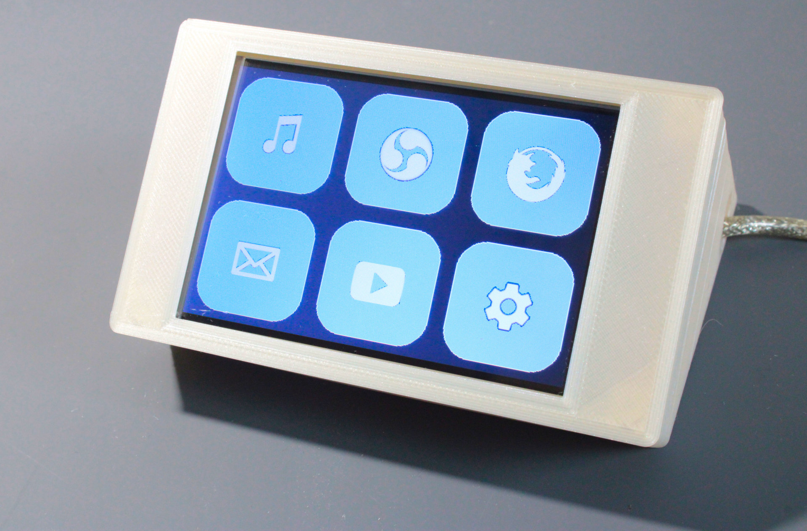
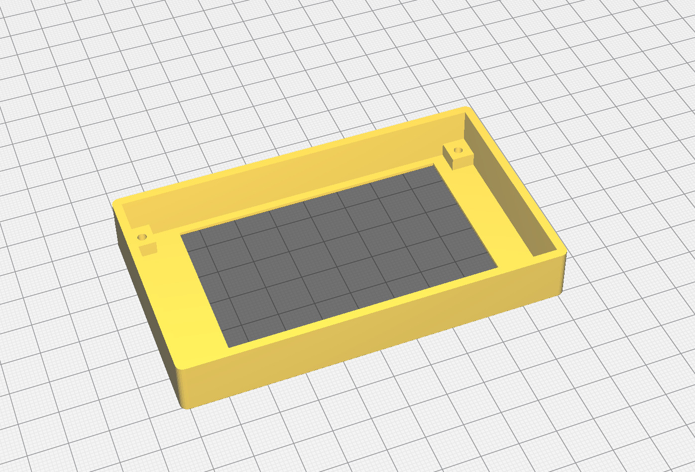
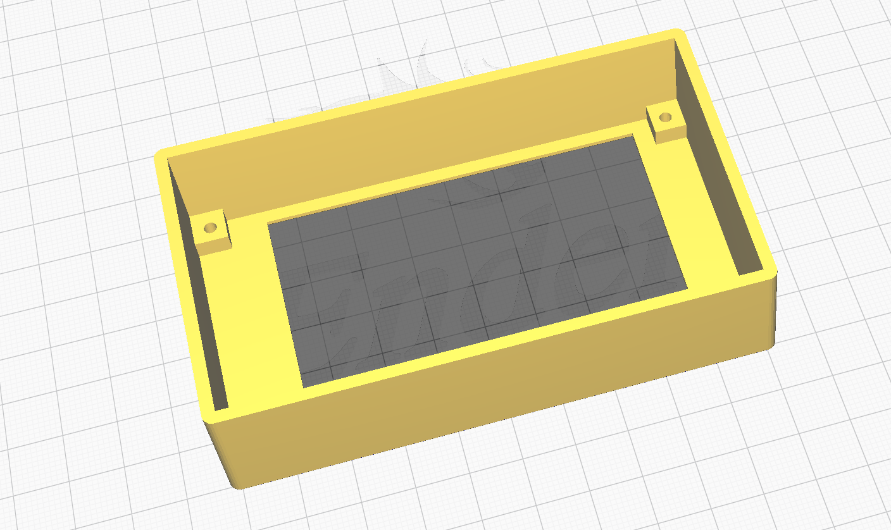
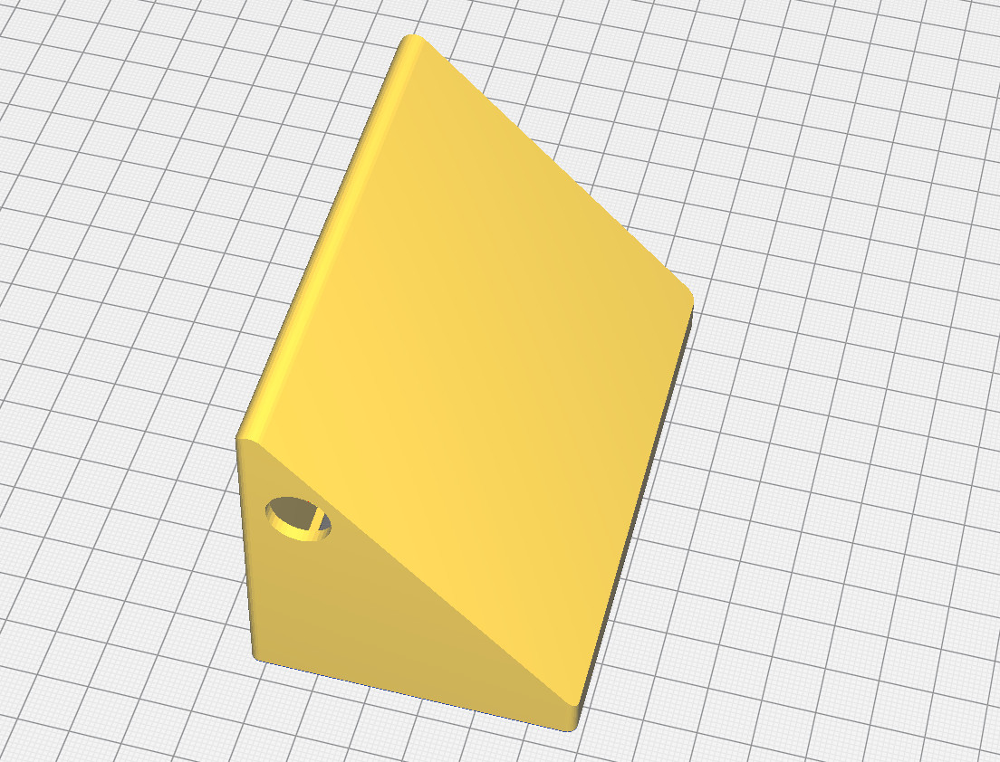

# FreeTouchDeck Case

**Pay attention! This case is for the combiner board. For the ESP32 TouchDown board, check this link: https://github.com/DustinWatts/esp32-touchdown/tree/main/Case**

You can print the case that will house both The ILI9488 + TFT screen and you ESP32 in a nice case. This housing is made with the ESP32 TFT Combiner PCB in mind, but will also work if you made your FreeTouchDeck on a prototyping board.

This case is made to have a press fit. If you are happy with your print and don't plan on taking it apart again, you could use some CA glue to hold the two halves together, but is it not necessary.

## Two different "Top" versions

There are two "Top" versions. The only difference is that one of them is a bit higher. If you use the TFT + ESP32 combiner PCB with female headers for the TFT it needs a slightly higher front. So if you are using female headers for the TFT --> use Top_for_TFT_with_Headers.stl!

# Print settings

I recommend the following settings when printing the case:

## Top

- Orientation: Flat side down
- Layer height: 0.2 mm
- Infill: 100%
- Support: none

## Top for TFT with Headers

- Orientation: Flat side down
- Layer height: 0.2 mm
- Infill: 100%
- Support: none

## Bottom

- Orientation: The part that connects to the top down
- Layer Height: 0.2 mm
- Infill: 20%
- Support: Everywhere
- Support Overhang Angle: 70

Setting the Support Overhang Angle to 70 ensures that the hole for the USB cable and the the press fit ridge are properly supported, but doesn't over-support everything.

You can also download the case from Thingiverse: [FreeTouchDeck Case](https://www.thingiverse.com/thing:4661069)

Or any of the awesome cases other people have designed! [FreeTouchDeck Cases on Thingiverse](https://www.thingiverse.com/search?q=freetouchdeck&type=things&sort=relevant)
